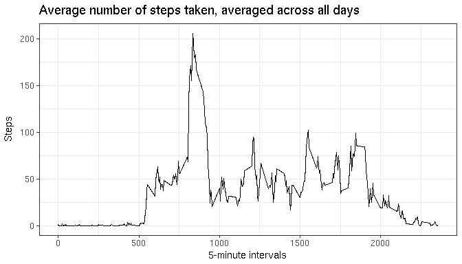

# Reproducible Research: Peer Assessment 1

## 1-Setting global options & load libraries


```r
knitr::opts_chunk$set(echo = TRUE)
library(dplyr)
library(ggplot2)
library(cowplot)
```

## 2-Loading and preprocessing the data

```r
data<-read.csv("activity.csv")
data<-mutate(data, date = as.Date(date, format= "%Y-%m-%d"))
str(data)
```

```
## 'data.frame':	17568 obs. of  3 variables:
##  $ steps   : int  NA NA NA NA NA NA NA NA NA NA ...
##  $ date    : Date, format: "2012-10-01" "2012-10-01" ...
##  $ interval: int  0 5 10 15 20 25 30 35 40 45 ...
```

## 3-What is mean total number of steps taken per day?
### Calculate the total number of steps taken per day (N.A. count is for futher)

```r
group_by(data,date) %>%
summarise(count_steps=sum(steps, na.rm = TRUE), 
          count_na = sum(is.na(steps)),
          count_not_na = sum(!is.na(steps))) -> summary_steps_by_day
str(summary_steps_by_day)
```

```
## Classes 'tbl_df', 'tbl' and 'data.frame':	61 obs. of  4 variables:
##  $ date        : Date, format: "2012-10-01" "2012-10-02" ...
##  $ count_steps : int  0 126 11352 12116 13294 15420 11015 0 12811 9900 ...
##  $ count_na    : int  288 0 0 0 0 0 0 288 0 0 ...
##  $ count_not_na: int  0 288 288 288 288 288 288 0 288 288 ...
```

### Make an histogram

```r
g<- ggplot(summary_steps_by_day, aes(x=date, y=count_steps))
p <- g + geom_bar(stat="identity") + 
         labs(title="Total number of steps taken per day", x="Days", y= "Steps") +
         theme_bw()
print(p)
```

<!-- -->

### Calculate and report the mean and median of the total number of steps taken per day

```r
mean_steps_per_days <- mean(summary_steps_by_day$count_steps)
mean_steps_per_days <- format(mean_steps_per_days)

median_steps_per_days <- median(summary_steps_by_day$count_steps)
median_steps_per_days <- format(median_steps_per_days)
```
* Mean of the total number of steps taken per day: _9354.23_
* Median of the total number of steps taken per day: _10395_


## 4-What is the average daily activity pattern?
### Make a time series plot of the 5-minute interval and the average number of steps taken, averaged across all days

```r
group_by(data,interval) %>%
summarise(somme=sum(steps, na.rm = TRUE),
          mean=mean(steps, na.rm = TRUE), 
          median=median(steps, na.rm = TRUE),
          count_na = sum(is.na(steps)),
          count_not_na = sum(!is.na(steps))) -> summary_steps_by_interval

g<- ggplot(summary_steps_by_interval, aes(x=interval, y=mean))
p <- g + geom_line() + labs(title="Average number of steps taken, averaged across all days", x="5-minute intervals", y= "Steps") + theme_bw()
print(p)
```

<!-- -->

### Which 5-minute interval, on average across all the days in the dataset, contains the maximum number of steps?

```r
max_steps_interval <- filter(summary_steps_by_interval, mean==max(mean))$interval
```
* 5-minute interval with the maximum number of steps: _835_


## 5-Imputing missing values
### Calculate and report the total number of missing values in the dataset

```r
count_missing_values <- sum(is.na(data$steps))
```
* Missing values in the data set: _2304_

### Devise a strategy for filling in all of the missing values in the dataset.
* 2 basic strategies are possible:  
 -filling N.A. with mean of the day  
 -filling N.A. with mean of the 5-minute interval  
* See diagrams below:

```r
g<- ggplot(summary_steps_by_day, aes(x=date, y=count_not_na))
p <- g + geom_point() + 
         labs(title="Available data per day", x="Days", y= "Available data (Steps)") +
         theme_bw()

g1<- ggplot(summary_steps_by_interval, aes(x=interval, y=count_not_na))
p1 <- g1 + geom_point() + 
         labs(title="Available data per interval ", x="5-minute interval", y= "Available data (Steps)") +
         theme_bw()

plot_grid(p, p1, ncol = 2, nrow = 1)
```

<!-- -->

* Data is missing for some completes days: filling N.A. with mean of the day is a bad strategy
* Data is never missing for interval : __filling N.A. with mean of its 5-minute interval is a better strategy__

### Create a new dataset that is equal to the original dataset but with the missing data filled in

```r
## create the new dataset without NA
mean_per_interval <-select(summary_steps_by_interval,c(interval, mean))
new_data_set <- full_join(data,mean_per_interval, by = "interval")
new_data_set <- mutate(new_data_set, steps= ifelse(is.na(steps), mean, steps))
new_data_set <- select(new_data_set, -c(mean))
str(new_data_set)
```

```
## 'data.frame':	17568 obs. of  3 variables:
##  $ steps   : num  1.717 0.3396 0.1321 0.1509 0.0755 ...
##  $ date    : Date, format: "2012-10-01" "2012-10-01" ...
##  $ interval: int  0 5 10 15 20 25 30 35 40 45 ...
```

### Make a histogram of the total number of steps taken each day for the new data set

```r
group_by(new_data_set,date) %>%
summarise(count_steps=sum(steps, na.rm = TRUE), 
          count_na = sum(is.na(steps)),
          count_not_na = sum(!is.na(steps))) -> new_summary_steps_by_day

g<- ggplot(new_summary_steps_by_day, aes(x=date, y=count_steps))
p <- g + geom_bar(stat="identity") + 
         labs(title="Total number of steps taken per day(new data set)", x="Days", y= "Steps") +
         theme_bw()
print(p)
```

<!-- -->

### Calculate and report new mean and median of the total number of steps taken per day ; and compare them with first data set (with N.A.)

```r
new_mean_steps_per_days <- mean(new_summary_steps_by_day$count_steps)
new_mean_steps_per_days <- format(new_mean_steps_per_days)

new_median_steps_per_days <- median(new_summary_steps_by_day$count_steps)
new_median_steps_per_days <- format(new_median_steps_per_days)
```
__Mean and median of the total number of steps taken per day:__    

|Data Set|Mean|Median|
|:----:|:----:|:----:|
|Data set with N.A.|9354.23|10395|
|new Data set without N.A.|10766.19|10766.19|


## 6-Are there differences in activity patterns between weekdays and weekends?
### Create a new factor variable in the dataset with two levels – “weekday” and “weekend” indicating whether a given date is a weekday or weekend day.

```r
new_data_set<-mutate(new_data_set, day = as.POSIXlt(date)$wday) # 0:sunday, 1: monday, ...
# I'dont use weekdays(), because it returns days in local language
new_data_set<-mutate(new_data_set, day= ifelse((day == 0 | day == 6), "Weekend","Weekday"))
new_data_set<-mutate(new_data_set, day= factor(day))

str(new_data_set)
```

```
## 'data.frame':	17568 obs. of  4 variables:
##  $ steps   : num  1.717 0.3396 0.1321 0.1509 0.0755 ...
##  $ date    : Date, format: "2012-10-01" "2012-10-01" ...
##  $ interval: int  0 5 10 15 20 25 30 35 40 45 ...
##  $ day     : Factor w/ 2 levels "Weekday","Weekend": 1 1 1 1 1 1 1 1 1 1 ...
```

```r
summary(new_data_set$day)
```

```
## Weekday Weekend 
##   12960    4608
```

### Make a panel plot containing a time series plot of the 5-minute interval (x-axis) and the average number of steps taken, averaged across all weekday days or weekend days (y-axis). 

```r
group_by(new_data_set, day) %>%
summarise(mean_day = mean(steps)) -> mean_by_day

group_by(new_data_set, interval, day) %>%
summarise(mean_interval = mean(steps)) -> mean_by_interval

d <- left_join(mean_by_interval, mean_by_day,by="day")
d <- mutate(d, mean_averaged = (mean_interval-mean_day)/mean_day)

g<- ggplot(d, aes(x= interval, y= mean_averaged, col= day))
p <- g + geom_line(stat="identity") +
         facet_grid(day~ .) +
         labs(title="Average number of steps taken, averaged across all weekday or weekend days", x="5-minute interval", y= "Relative averaged steps") +
         theme_bw()
print(p)
```

<!-- -->
